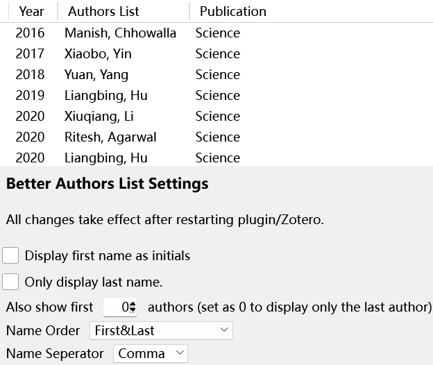
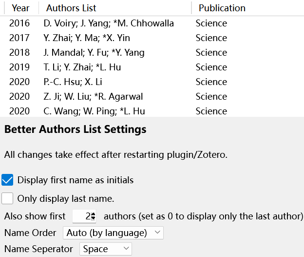

# Zotero Better Authors

This is a simple plugin for [Zotero](https://www.zotero.org/) 7. See this [announcement](https://forums.zotero.org/discussion/105094/announcing-the-zotero-7-beta) for Zotero 7 Beta.

## Features

- Display the last author in a new column as it is usually more important than the first author.
- Support changing the display style of the first name: full or initials.
- Display the first N authors together with the last author
- Customize the displayed authors style including: separators and orders.

## Usage & Screenshots

The displayed content and style can be customized in the plugin settings.

Here are two examples:

Full name of the last author:

Initials of the first 2 authors and the \*last author:

## Disclaimer

Use this code under AGPL. No warranties are provided. Keep the laws of your locality in mind!

If you want to change the license, please contact the original developer at <wyzlshx@foxmail.com>.
