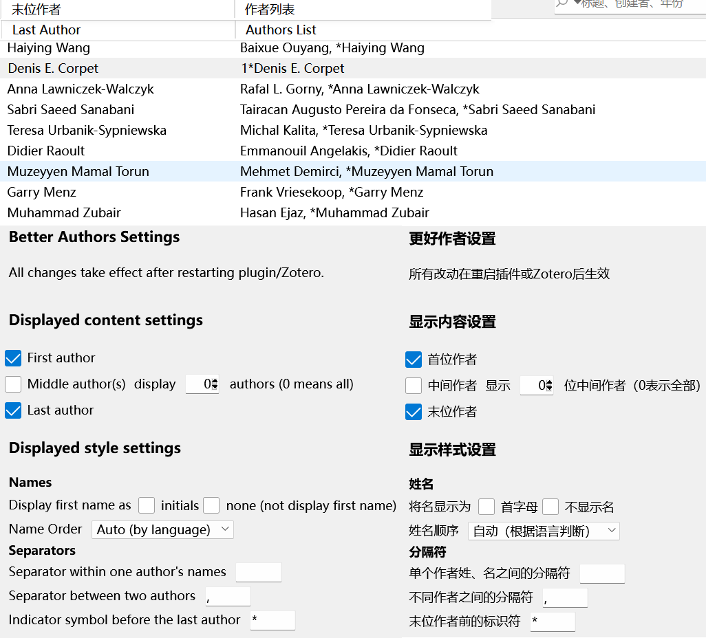

# Zotero Better Authors （Zotero更好作者）

This is a simple plugin for [Zotero](https://www.zotero.org/) 7. See this [announcement](https://forums.zotero.org/discussion/105094/announcing-the-zotero-7-beta) for Zotero 7 Beta.

这是 Zotero 7 的一个简单插件。有关 Zotero 7 Beta 信息，请参考[这个声明](https://forums.zotero.org/discussion/105094/announcing-the-zotero-7-beta)。

## Features （功能）

- **Last Author** Display the last author in a new column as it is usually more important than the first author.
- **Authors List** Display the authors in a new column with customizable displayed contents and styles

  - Choose whether to display: first author, middle authors (all or partial), and last author
  - Customize the symbol(s) to separate authors (either in one author or between authors, _e. g._ `,` `;` ` `), and to indicate the last author (_e. g._ `*` `†` `‡` `⸸`)
  - Choose the name orders for displaying authors: `Firstname Lastname`, `Lastname Firstname`, or `auto (according to the language of the authors names)`

- **末位作者** 单独一列显示末尾作者，因为通常末位作者是通讯作者或PI
- **作者列表** 单独一列显示作者列表，可以定制显示内容与风格
  - 选择显示哪些作者：首位作者，中间作者（可选 全部/部分），末位作者
  - 自定义用于分隔作者（单个作者姓、名，或多个作者之间）的分隔符号（如 `,` `;` ` `），以及用于标注末位作者的符号（如 `*` `†` `‡` `⸸`）
  - 选择显示姓名的顺序：`名姓`，`姓名`，或 `自动（根据作者名字的语言处理）`

## Usage & Screenshots

This plugin comes with a self-explanatory settings panel in Zotero 7 settings. An example of the displayed authors and corresponding settings (with English and Chinese support) is given in the screenshot.

此插件带有一个简单明了的设置页面。下面的截图给出了一个显示效果和对应设置（有中英文支持）的例子。

## Disclaimer

Use this code under AGPL. No warranties are provided. Keep the laws of your locality in mind!

If you want to change the license, please contact the original developer at <wyzlshx@foxmail.com>.
