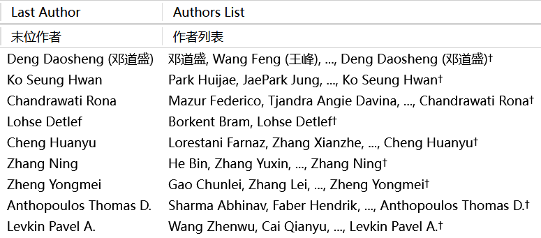

# Zotero Better Authors （Zotero 更好作者）

[](https://www.zotero.org)
[](https://github.com/windingwind/zotero-plugin-template)

[中文说明](./docs/README_CN.md)

This is a simple plugin for [Zotero](https://www.zotero.org/) 7. See this [announcement](https://forums.zotero.org/discussion/105094/announcing-the-zotero-7-beta) for Zotero 7 Beta.

## Installation

- Go to the [latest release](https://github.com/github-young/zotero-better-authors/releases/latest).
- Download the file `zotero-better-authors.xpi` by saving it as a file.
- Drag the `xpi` file into Zotero's plugin manager or use "install via file" and select the `xpi` file.

## Features

- **Last Author** Display the last author in a new column as it is usually more important than the first author.
- **First Author** Display the first author in a new column.
- **Authors List** Display the authors in a new column with customizable displayed contents and styles

  - Choose whether to display: first N authors (all or partial), and the last author
  - Customize the symbol(s) to separate authors (either in one author or between authors, _e. g._ `,` `;` ` `), and to indicate the last author (_e. g._ `*` `†` `‡` `⸸`)
  - Choose the name orders for displaying authors: `Firstname Lastname`, `Lastname Firstname`, or `auto (according to the language of the authors names)`

## Usage & Screenshots

This plugin comes with a self-explanatory settings panel in Zotero 7 settings. An example of the displayed authors and corresponding settings (with English and Chinese support) is given in the screenshot.

Displayed authors



Settings


## Contributing

```bash
# clone code
git clone https://github.com/github-young/zotero-better-authors.git
cd zotero-better-authors

# install deps
corepack enable
pnpm i

# config env
cp .env.example .env
vi .env

# development
pnpm start
pnpm build

# code format and lint
pnpm build
```

## Disclaimer

Use this code under AGPL. No warranties are provided. Keep the laws of your locality in mind!

If you want to change the license, please contact the original developer at <wyzlshx@foxmail.com>.
