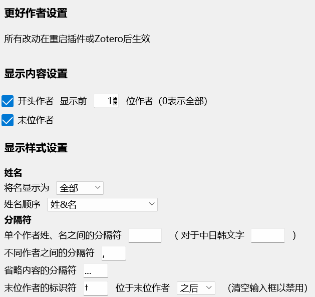

# Zotero Better Authors （Zotero更好作者）

这是 Zotero 7 的一个简单插件。有关 Zotero 7 Beta 信息，请参考[这个声明](https://forums.zotero.org/discussion/105094/announcing-the-zotero-7-beta)。

## 安装

- 前往[最新的release页面](https://github.com/github-young/zotero-better-authors/releases/latest).
- 下载 `zotero-better-authors.xpi`，右键选择 `另存为文件`.
- 将 `xpi` 文件拖放进 Zotero 的插件管理器，或者在插件管理器内点击 "从文件安装" 选取 `xpi` 文件.

## 功能

- **末位作者** 单独一列显示末位作者，因为通常末位作者是通讯作者或PI
- **首位作者** 单独一列显示首位作者
- **作者列表** 单独一列显示作者列表，可以定制显示内容与风格
  - 选择显示哪些作者：开头作者（可选 全部/部分），末位作者
  - 自定义用于分隔作者（单个作者姓、名，或多个作者之间）的分隔符号（如 `,` `;` ` `），以及用于标注末位作者的符号（如 `*` `†` `‡` `⸸`）
  - 选择显示姓名的顺序：`名姓`，`姓名`，或 `自动（根据作者名字的语言处理）`

## 用法与截图

此插件带有一个简单明了的设置页面。下面的截图给出了一个显示效果和对应设置的例子。

显示效果

设置选项

## Disclaimer

Use this code under AGPL. No warranties are provided. Keep the laws of your locality in mind!

If you want to change the license, please contact the original developer at <wyzlshx@foxmail.com>.
